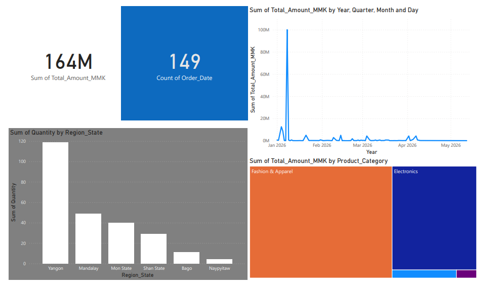
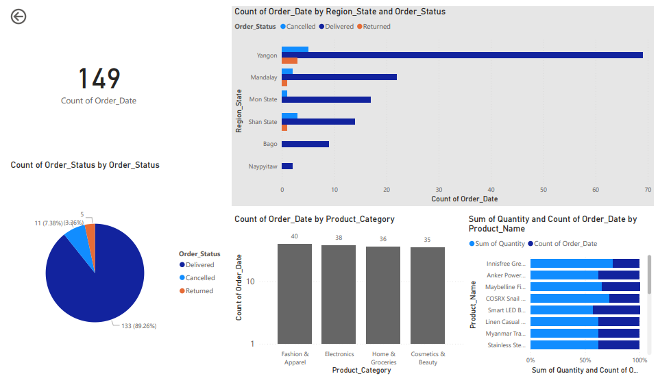
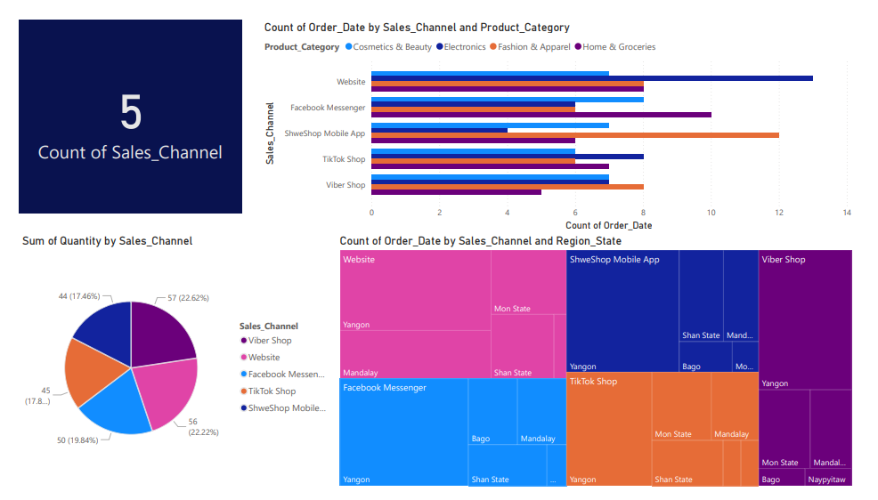

# 🛒 Myanmar E-Commerce Sales Analysis
> **Data Analyst Portfolio Project** — End-to-end analysis of Myanmar e-commerce transactions covering data cleaning, SQL analysis, Power BI dashboard, and PDF reporting.

---

## 📊 Dashboard Preview

> *Open `finalReport.pbix` in Power BI Desktop to explore the interactive dashboard*
>
 ### Page 1 — Revenue Overview


### Page 2 — Product & Order Analysis


### Page 3 — Sales Channel & Region


---

## 📁 Project Structure

```
analytics/
├── data/
│   ├── Myanmar_Ecommerce_Sales_Dirty_Data8.xlsx   # Raw dataset (dirty — 154 rows)
│   └── Myanmar_Ecommerce_Sales_Dirty_Data8.xlsx   # Cleaned output (150 rows)
├── index.py                                        # Data cleaning script (Python)
├── finalReport.pbix
├──images
    ├──images.PNG                               # Power BI interactive dashboard
├── Myanmar_Ecommerce_Analysis_Report.pdf           # Final PDF report (12 pages)
└── README.md                                       # Project documentation
```

---

## 🎯 Business Problem

A Myanmar e-commerce platform collected 4 months of sales data (January – April 2026) across 6 regions, 5 sales channels, and 4 product categories. The raw data was dirty and unusable for analysis.

**Goal:** Clean the data, uncover revenue patterns, and deliver actionable insights for business decision-making.

**Key questions answered:**
- Which region generates the most revenue — and which is underserved?
- Which product category has the highest revenue per order?
- What caused the March 2026 revenue spike (+74.8%)?
- Which sales channel and payment method should the business prioritise?

---

## 🔍 Key Findings

| # | Finding | Impact |
|---|---------|--------|
| 1 | **Yangon drives 54.5% of total revenue** (89.45M MMK) | Geographic concentration risk |
| 2 | **Electronics earns 1.38M MMK per order** — highest of all categories | Focus premium marketing here |
| 3 | **March 2026 spiked +74.8%** MoM to 52.1M MMK | Identify and replicate the trigger |
| 4 | **79.2% of orders used digital payment** (AYAPay, KBZPay, WaveMoney) | Strong fintech adoption signal |
| 5 | **7.4% cancellation rate** = ~11M MMK in lost potential revenue | High-priority fix for operations |

---

## 🧹 Data Cleaning Summary

The raw dataset (154 rows) contained **9 types of data quality issues** — all resolved before analysis.

| Issue | Rows Affected | Fix Applied |
|-------|:---:|---------|
| Exact duplicate rows | 4 | `drop_duplicates(keep='first')` |
| Impossible outlier value (99,999,999 MMK) | 1 | Recalculated as `Unit_Price × Quantity` |
| Text casing inconsistency (categories & payment) | 13 | Mapped to canonical values via `replace()` |
| Region abbreviation (`Ygn` → `Yangon`) | 6 | String replacement |
| Mixed date formats (DD/MM/YYYY, YYYY.MM.DD) | 2 | `pd.to_datetime(infer_datetime_format=True)` |
| Malformed phone numbers (`+959-...`, spaces) | 2 | Custom `clean_phone()` function |
| Missing `Total_Amount_MMK` | 5 | Calculated: `Unit_Price_MMK × Quantity` |
| Missing `Phone_Number` | 6 | Filled with `'Unknown'` |
| Missing `Ship_Date` | 5 | Filled with `'Unknown'` |

**Result: 154 rows → 150 clean rows · 0 remaining issues**

---

## 🛠️ Tools & Technologies

| Layer | Tool | Purpose |
|-------|------|---------|
| **Data Cleaning** | Python 3 · Pandas · OpenPyXL | Clean raw Excel data, fix all 9 issues |
| **Visualisation** | Power BI Desktop | Interactive 3-page sales dashboard |
| **Reporting** | Python · Matplotlib · ReportLab | Generate professional 12-page PDF report |
| **Data Storage** | Excel (.xlsx) | Raw and cleaned dataset |
| **Version Control** | Git · GitHub | Project tracking and sharing |

---

## 🚀 How to Run

### 1. Clone the repository
```bash
git clone https://github.com/YOUR_USERNAME/analytics.git
cd analytics
```

### 2. Install dependencies
```bash
pip install -r requirements.txt
```

### 3. Run the data cleaning script
```bash
python index.py
```
This will read the raw Excel file from `data/`, apply all 9 cleaning steps, and save the cleaned output.

### 4. Open the dashboard
Open `finalReport.pbix` in **Power BI Desktop** (free download from Microsoft).

### 5. View the PDF report
Open `Myanmar_Ecommerce_Analysis_Report.pdf` — no software needed.

---

## 📦 Requirements

```
pandas>=2.0
openpyxl>=3.1
matplotlib>=3.7
reportlab>=4.0
numpy>=1.24
```

> Install all at once: `pip install pandas openpyxl matplotlib reportlab numpy`

---

## 📈 Dashboard Pages

| Page | Content |
|------|---------|
| **Page 1** | Revenue by Region · Monthly Trend · Total KPIs |
| **Page 2** | Order Status · Product Category · Regional Breakdown |
| **Page 3** | Sales Channel · Channel × Category · Channel × Region |

---

## 💡 Recommendations

Based on the analysis, three high-priority actions for the business:

1. **Replicate March 2026** — Investigate what drove the +74.8% spike and engineer it again in Q3/Q4. Even a 50% replication adds ~9M MMK to annual revenue.

2. **Expand into Mon State & Shan State** — Both regions show 18 orders each but lower average order values. Targeted promotions and local payment support could unlock significant revenue without new customer acquisition cost.

3. **Reduce the 7.4% cancellation rate** — A root-cause audit of the 11 cancelled orders by category, region, and channel would identify the highest-priority operational fix, recovering approximately 11M MMK in lost revenue.

---

## 📄 Report

The full 12-page PDF report (`Myanmar_Ecommerce_Analysis_Report.pdf`) includes:
- Executive summary with KPI cards
- Revenue by region with breakdown table
- Product category analysis (revenue vs. order volume)
- Monthly trend analysis with MoM percentage changes
- Sales channel and payment method breakdown
- Order status and fulfilment quality analysis
- Complete data cleaning audit log
- Data-driven recommendations

---

## 👤 Author

**Kaung Khant Lin**
Junior Data Analyst | Myanmar

- 📧 kaungkhantlin2332003@gmail.com
- 💼 [LinkedIn Profile](https://www.linkedin.com/in/kaung-khant-lin-792b13390/)
- 🐙 [GitHub](https://github.com/ARIESTANK)

---

## 📝 License

This project uses a synthetic/mock dataset for portfolio and educational purposes only.
No real customer or business data is included.

---

*Made with Python · Power BI · ReportLab · ❤️ from Myanmar 🇲🇲*
"# E_Commerce_Sales_Analysis"
